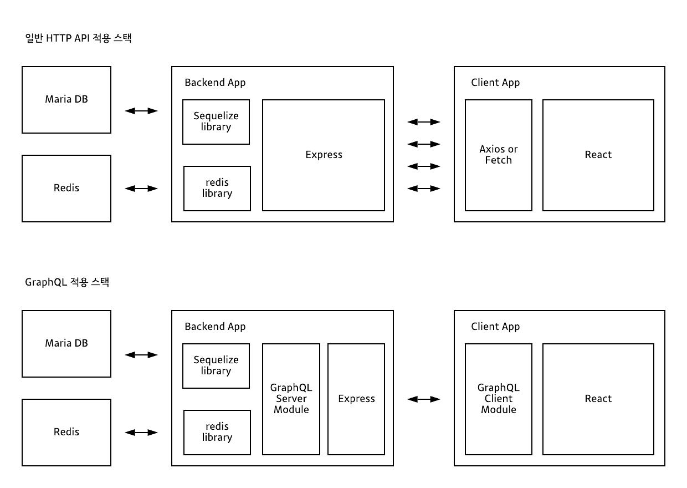

# GraphQL

## 정의

- 페이스북 2012년 에 개발된 언어
- API를 위한 쿼리 언어

## 쿼리 언어? 질의어?

- sql (Structured Query Language) : 구조화 질의어
  - 데이터베이스에서 데이터를 저장하거나 얻기 위해서 사용하는 표준화된 언어
  - 백엔드 에서 저장하고 호출한다.

* GraphQL
  - 서버에서 데이터를 저장하거나 얻기 위해서 사용하는 데이터 질의어
  - 클라이언트에서 저장 하고 호출한다.

```
sql)
select * from table;

graphql)
query {
  table {
    id
    name
  }
}

```

## 인기도

[https://2019.stateofjs.com/data-layer/graphql/](https://2019.stateofjs.com/data-layer/graphql/)

## 지원 언어

[지원 언어 맟 라이브러리](https://graphql.org/code/)

## REST API

```
REST 는 Roy Fielding 의
“Architectural Styles and the Design of Network-based Software Architectures” 라는 책에서 소개된 방법론으로,
REpresentational State Transfer 의 줄임말이다.
```

- 예시
  - 글 관련 API = /posts
  - 글 작성 = POST /posts
  - 글 수정 = PATCH /posts/[postid]
  - 글 삭제 = DELETE /posts/[postid]
  - 댓글 관련 API = /posts/[postid]/comments
  - 댓글 작성 = POST /posts/[postid]/comments
  - 댓글 수정 = PATCH /posts/[postid]/comments/[commentid]
  - 댓글 삭제 = DELETE /posts/[postid]/comments/[commentid]

* 이런 REST 의 조건을 만족하는 API 를 RESTful API 라고 부르고, 이런 방식으로 API 를 작성하는 것을 RESTful 하다고 한다.

- 모든 Resource (자료, User, …) 들을 하나의 Endpoint 에 각각 연결해놓고,
  각 Endpoint 는 그 Resource 와 관련된 내용만 관리하게 하자는 방법론이다.

## GraphQL 탄생 하게 된 이유

- RESTful API 로는 다양한 기종에서 필요한 정보들을 일일히 구현하는 것이 힘들었다.
- 예로, iOS 와 Android 에서 필요한 정보들이 조금씩 달랐고, 그 다른 부분마다 API 를 구현하는 것이 힘들었다.
- 이 때문에 정보를 사용하는 측에서 원하는 대로 정보를 가져올 수 있고,
- 보다 편하게 정보를 수정할 수 있도록 하는 표준화된 Query language 를 만들게 되었다.
- 이것이 GraphQL 이다.

## GraphQL 과 Rest Api 차이점

- 엔드 포인트 차이




## GraphQL 의 장점

<hr>

#### 1. Over-Fetching

- Data Structure

```
users [
  {
    id: 1
    name: 테스트1
    description: 설명1
    alias: 별명1
    ...etc
  },
  {
    id: 2
    name: 테스트2
    description: 설명2
    alias: 별명2
    ...etc
  },
  {
    id: 3
    name: 테스트3
    description: 설명3
    alias: 별명3
    ...etc
  },
  {
    id: 4
    name: 테스트4
    description: 설명4
    alias: 별명4
    ...etc
  }
]
```

- Rest Api

  - /users GET (User Profile Info)
  - 내가 받고 싶지 않은 정보도 받아야 한다.

* GraphQL
  - 내가 받고 싶은 데이터만 쿼리로 질의해서 가져올수가있다.
  ```
  query {
    users {
      id
      alias
    }
  }
  ```

- 필요 하지 않은 데이터를 받지 않으므로 메모리 및 Response Size를 줄일수있다.

#### 2. Under-Fetching - 1

- 어떤 하나의 서비스를 만들기 위해서 여러개의 요청을 보내야 할 필요가 있다.
- 하지만 그래프 QL 은 쉽게 해결이 가능하다.

- Rest Api


- Graph QL


#### 2. Under-Fetching - 2

- Rest Api

```
/feed
/notifications
/user
```

- Graph QL

```
query {
  feed {
    id
  }
  notifications {
    name
  }
  user {
    username
    alias
  }
}

```

#### 3. Play Ground

[http://dev.energyx.co.kr/graphql](http://dev.energyx.co.kr/graphql)

- Postman + Swagger + Schema 정의

## GraphQL 의 단점

- HTTP 캐싱 사용 불가능

  - Apollo Engine 자체적으로 캐시

- 파일업로드

  - 외부 라이브러리를 사용해서 업로드 하다가 Upload multipart-form data

- 재귀적 쿼리

  - 외부 라이브러리 사용 하여 해결

- Response 가 JSON 엑셀다운로드 등 여러기능이 불가능하다.

- 표준이 없다.

## 결론

- GrapqhQL 은 Rest Api의 훌륭한 대체제가 될수있다.
