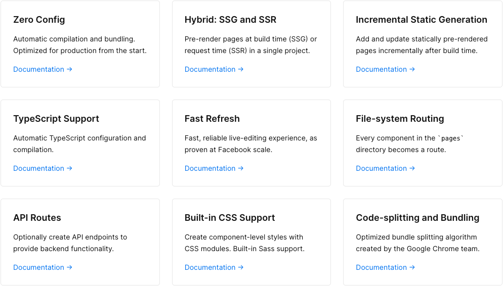
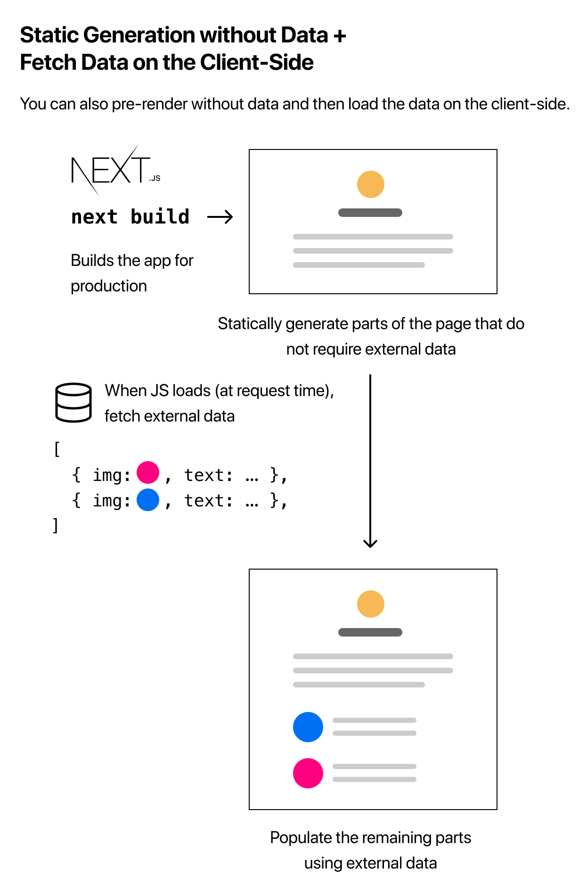

# Next.js

## The React Framework for Production

## 특징 장점

 

<!-- Branch 2-navigate -->

### 파일 시스템 라우팅

- Next.js 에서, 페이지는 'pages' 디렉토리의 파일로 부터 export 된 React 컴포넌트 입니다.

- 페이지들은 파일 이름에 기초해 라우트와 연관되어 있습니다.

- 파일명 대,소문자 구분 및 여러 가지가 파일 이름에 관련되어있습니다.

- export default 만 하면 되고 컴포넌트 함수명은 아무런 관계가 없습니다.

 

### API 라우팅

- pages 폴더에 보면 api 라고 되어있는 hello.js 가 있을것이다.
- Next.js 는 서버의 역활도 할수있기 때문에 내부 api 서버를 커스텀 하여 사용할수있다.
- 서버리스 함수로도 배포 될수있다.
- 서버쪽 번들로 클라이언트쪽 번들의 사이즈에 영향을 주지 않는다.

 

### Link 컴포넌트

- React-router-dom || Vue Router 처럼 Next.js 파일 시스템 라우팅이 아닌 클라이언트 사이드 네비게이션 라우팅을 제공 하는 next.js 컴포넌트

 

### Router 컴포넌트

- Next.js 에서는 기존의 React-router-dom 에서 사용하는 것처럼 useRouter 훅이 존재한다.
- 그리고 그 훅을 호출하여 받은 객체로 기존의 React 에서 하는것처럼 router 사용이 가능하다.

### 코드 스플리팅 && 프리패칭

- Next.js 는 자동으로 코드 스플리팅을 합니다.
- 각 페이지는 오직 그 페이제 필요한 것들만을 불러옵니다.
- 이는 페이지가 렌더링 될때, 다른페이지들을 위한 코드들을 처음에 같이 로드 하지 않습니다.
   

- 오직 요청한 페이지의 코드만을 로딩한다는 것은 그 페이지가 고립되었음을 의미하고, 만약 특정 페이지에서 에러가 발생해도, 다른 나머지 페이지들은 여전히 작동할 것입니다.
- 페이지가 로드 가 된뒤 에 next.js 는 prefetching을 하여 해당 컴포넌트에 잇는 Link컴포넌트의 코드들을 프리패칭하여 저장한다.
- 그래서 해당 페이지로 이동할때 prefetching된 코드를 사용하여 빠른 로딩이 가능하다.

<!-- Branch 3-get-static-props -->

### 사전 렌더링

- 기본적으로 Next.js는 모든 페이지를 사전-렌더링 합니다.
- 이는 클라이언트 사이드 자바스크립트로 모든 작업을 하는 대신, Next.js 가 HTML을 각 페이지들을 위해 미리 생성한다는 것을 말합니다.
- 사전-렌더링을 하여 더 나은 성능과 SEO(검색 엔진 최적화)를 얻을 수 있습니다.

#### Pre-rendering vs No Pre-rendering

 

### Next.js 의 사전 렌더링

- Next.js는 두 가지 형태의 사전-렌더링을 가지고 있습니다: 정적 생성과 서버 사이드 렌더링 입니다.
- 페이지를 위한 HTML 을 생성할 때 차이점이 있습니다.

 

#### 페이지당 기준

- 중요한 것은, Next.js가 각 페이지를 위해 어떤 사전-렌더링 형태를 사용할 것인지 선택하게 해줍니다.
- 대부분의 페이지에 정적 생성을 사용하고 나머지 페이지에 서버-사이드 렌더링을 사용하는 것으로 "하이브리드" Next.js 앱을 만들 수 있습니다.

#### 정적 생성 vs 서버-사이드 렌더링

- 정적 생성

  - 빌드 시 HTML을 생성하는 사전-렌더링 방법입니다. 그런 다음 사전-렌더링 된 HTML은 각 요청에서 재사용됩니다.

- 서버-사이드 렌더링

  - 각 요청마다 HTML을 생성하는 사전-렌더링 방법입니다.

- Next.js 는 가능하면 정적 생성을 사용하는것을 추천합니다.

- 유저의 요청 전에 페이지를 미리 렌더링 할 수 있을까? 정답이 yes 라면 정적 생성으로 랜더링 및 배포하는게 정답입니다.

- 하지만 유저의 요전 전에 페이지를 미리 렌더링 할수 없다면 서버-사이드 렌더링으로 매 요청마다 데이터를 다르게 보여줘야합니다.

#### GetStaticProps

- 정적으로 HTML 을 생성하기 전 외부 데이터 API 연결 혹은 데이터 베이스 쿼리등의 작업이 필요할때 사용하는 함수

- 빌드시에만 실행된다.

- 코드로 알아보자

### 요청 시 데이터를 가져오는게 필요하다면요?

- 유저의 요청 전에 미리 페이지를 렌더링 할 수없다면, 정적 생성방식인 GetStaticProps는 사용할수없다.

- 이런 경우, 서버-사이드 렌더링을 사용하거나 사전-렌더링을 건널뛸수있다.

<!-- Branch 4-get-server-side-props -->

#### getServerSideProps

- 빌드시 대신 요청시마다 데이터 가져오기가 필요하다면, 서버사이드 렌더링을 시도할 수있습니다.

- 서버에서 페이지를 렌더링 하기전 실행하고 사용자에게 랜더링 하게 된다.

- 서버에서 요청 마다 작업을 처리를 하여야 하며 특별한 설정없이는 CDN 에 의해 결과가 캐시 될 수 없습니다.

#### Client-Side Rendering

- 데이터를 사전-렌더링 할 필요 없으면 기존의 React 개발처럼 페이지만 정적으로 생성한뒤 클라이언트에서 데이터를 채웁니다.

<!-- Branch 5-get-static-paths -->

### 외부 데이터에 따른 페이지 경로

- 지금 까지 위에서는 외부 데이터에 따른 페이지 내용을 다루었습니다.

- 그러면 이제는 동적으로 외부 데이터에 따른 페이지 경로가 다른경우를 만들어봅시다.

#### getStaticPaths

- 파일명을 url path 값의 키 값으로 주고 해당 함수를 선언하여 동적 라우팅을 설정한다.

- getStaticPaths 는 꼭 getStaticProps 와 함께 사용해야한다.

- 리턴값은
  params: {
  id: String(data.id),
  },

로 이루어진 배열이어야 하며 String 으로 반납되어야한다.

#### getServerSideProps

- 마음편하게 serversideprops 쓰자
